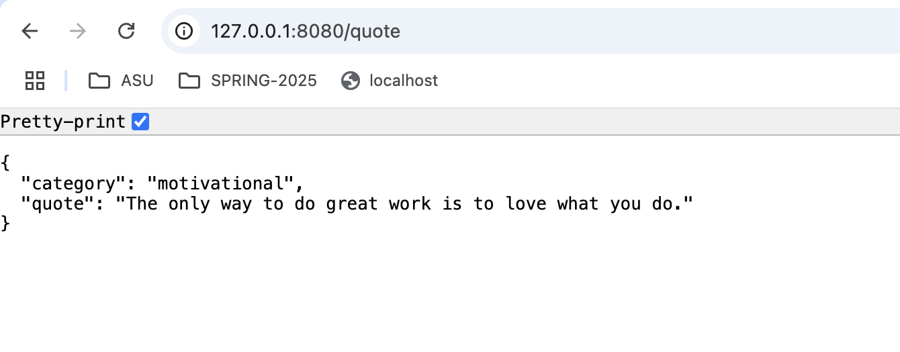
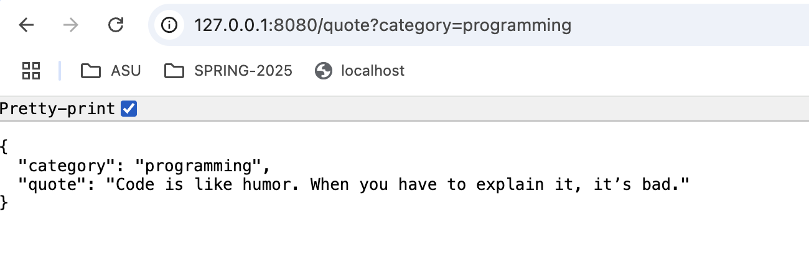
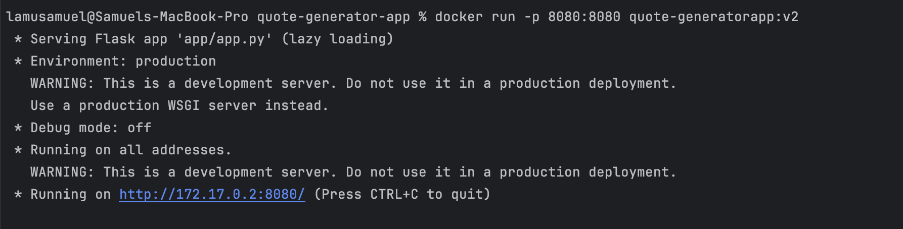
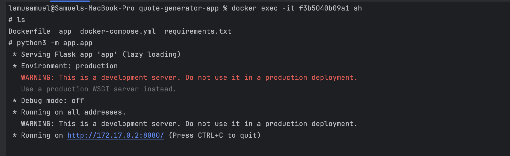

## QUOTE GENERATOR APP
This is a simple quote generator app,built using Flask and Docker.This app will allow us to generate random quotes based on category (motivational, life, programming... can be extended in app/quotes.json).
Backend API is built using the Flask and serves quotes in the JSON format.

### Table of Contents
1. [Prerequisites](#prerequisites)
2. [Setup](#setup)
3. [Running the app](#Running-the-App)
4. [Docker Setup](#Docker_setup)
5. [Running container from image](#Running_container_from_image)

## prerequisites
Before starting, please ,makesure to install the below tools.
1. Docker
2. Python 3.9 

### What are the files about :
    app/app.py : Main logic to run the flask app 
    app/quotes.json: Contains a collection of quotes categorized by groups.
    app/routes.py : Contains api for fetching random quotes
    app/utils.py : Contains function to get the quotes from app/quotes.json files
    Docker file: Instruction to build the image
    Requirements.txt: dependencies to be downloaded while building image, specified in the docker file.

## Setup:
1. Clone the Repository

        git clone https://github.com/LamuSamuel/quote-generator-app.git

        cd quote-generator-app

2. Install Python Dependencies Locally 

       pip install -r app/requirements.txt

Running the application with Flask
## Running_the_App

Make sure pwd is :  /quote-generator-app

    Run the command : python3 -m app.app

This will start a Flask development server on http://127.0.0.1:8080

Make sure the route is set to /quote so the final url is http://127.0.0.1:8080/quote . Refer below image

initially , the category is set to 'motivation' so if you wish to generate quotes related to life or programming. 
change the url to include the category which should seem like : http://127.0.0.1:8080/quote?category=life

Refer below image.

## Docker_setup
#### Setting the Docker.

Lets use docker to Containerise our application:

 Install docker from [here](https://docs.docker.com/desktop/setup/install/mac-install/)

Building the docker image :
    Make sure you are in the root directory where your Dockerfile is present.

Run below command :
    
    docker build -t quote-generatorapp:v2 .

(-t means tag  which means naming it and . at end means it build in your present directory).

## Running_container_from_image

After building the app : 

Run below command :

    docker run -d -p 8080:8080 quote-generatorapp:v2

This should start to launch a web session in your terminal which will be directed to execute the app script. 

Once you get the above prompt in terminal you are good to run the command in the local browser  http://127.0.0.1:8080/quote .

<u>Confused about what image and container is?</u>

Image is the one we build using docker commands . Container is a running instance of the image.

It's good we ran our script through a container but we will also try running it from the image .

    docker run -d -p 8080:8080 quote-generatorapp:v2 /bin/sh -c "sleep infinity"

The sleep infinity command above helps to make the container active and alive in the background so that we can get into our built image and can know what's in our image and how it works internally.

Use <b>docker ps </b> to know the current alive containers.

so we should be seeing container id's related to our image so in my case it is f3b5040b09a1

To get into container and see it's internal behaviour please use the below command 

docker exec -it <container id> sh , so in my case docker exec -it f3b5040b09a1 sh

it should open the container terminal and try running the app from the container terminal. refer below image 

Once you get the above prompt in terminal you are good to run the command in the local browser  http://127.0.0.1:8080/quote

